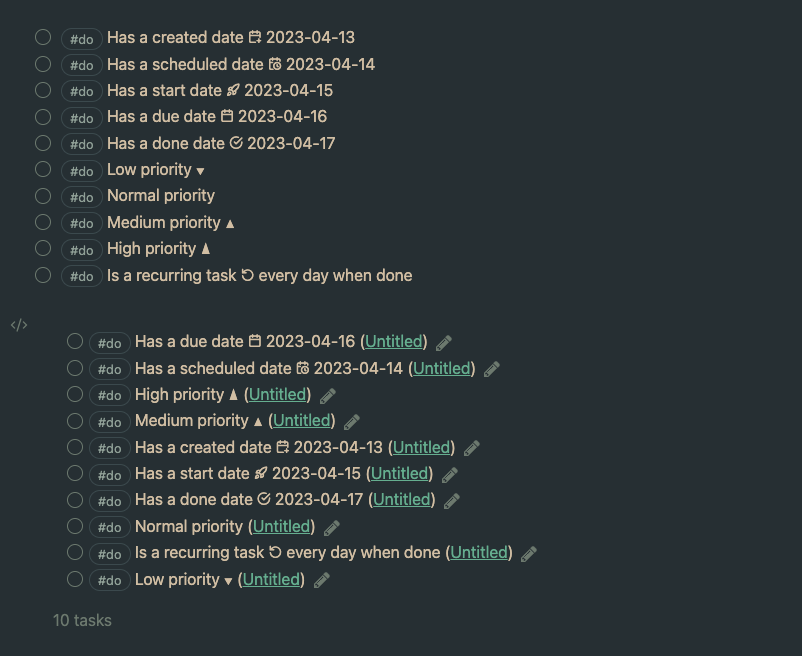

# Obsidian Tasks Custom Icons

This repository contains a commandline tool (for developers/designers) to easily create CSS snippets that when added to Obsidian will replace the emojis used by the [Obsidian Tasks](https://github.com/obsidian-tasks-group/obsidian-tasks) with monotone icons matching the text colour.

As a Tasks end-user, you can simply [install](https://help.obsidian.md/Extending+Obsidian/CSS+snippets) one of the CSS snippets in this repository to your obsidian vault to replace the [Tasks Emoji Format](https://publish.obsidian.md/tasks/Reference/Task+Formats/Tasks+Emoji+Format) emojis with monotone icons.

## Lucide-based Icon set

[Download CSS Snippet](https://raw.githubusercontent.com/replete/obsidian-tasks-custom-icons/main/lucide/obsidian-tasks-lucide-icons.css)

Date and recurring icons modified from https://lucide.dev

## EmojiTwo-based Icon set

[Download CSS Snippet](https://raw.githubusercontent.com/replete/obsidian-tasks-custom-icons/main/emojitwo/obsidian-tasks-emojitwo-icons.css)

Date and recurring icons modified from https://github.com/EmojiTwo/emojitwo/tree/master/svg_bw

## Creating a custom icon set

**Prerequisites:** Node.JS must be installed. I cannot provide support if this is unfamiliar, but it is fairly straightforward:

- Clone/fork/download this repository
- From a terminal, run `npm install` from the cloned/forked/downloaded directory
- Duplicate the `lucide` icon set folder, renaming it to your new icon set name, e.g. `fancyicons`
- Replace/edit the duplicated SVG files in your new folder
- Run `npm run build`, to generate `obsidian-tasks-<icon folder name>-icons.css` and `demo.html` files within each icon set folder
    - _Dev Tip:_ In the same folder, create a text file named `copysnippetpath.txt` containing an absolute path to another folder – e.g '`/Users/username/MyVault/.obsidian/snippets/`'. This will cause an extra copy of `obsidian-tasks-<icon folder name>-icons.css` to be written each time you run `npm run build`. If you specify your Obsidian snippet folder and enable it within obsidian, Obsidian will reload the snippet whenever it changes.
- Adjust SVG icons as desired

Consider opening a PR with your icon set, reproducing appropriate licenses within `LICENSE.TXT`.

## Support development

