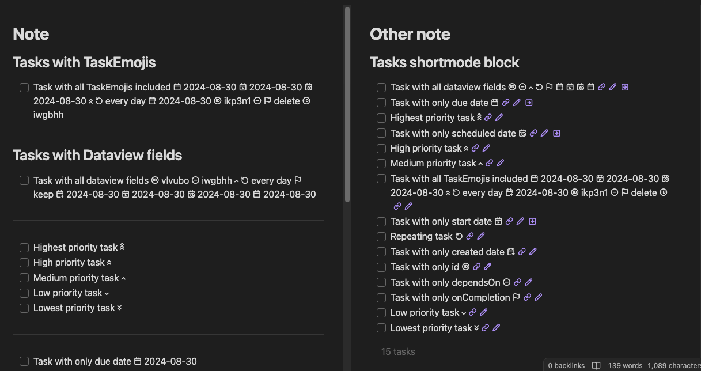
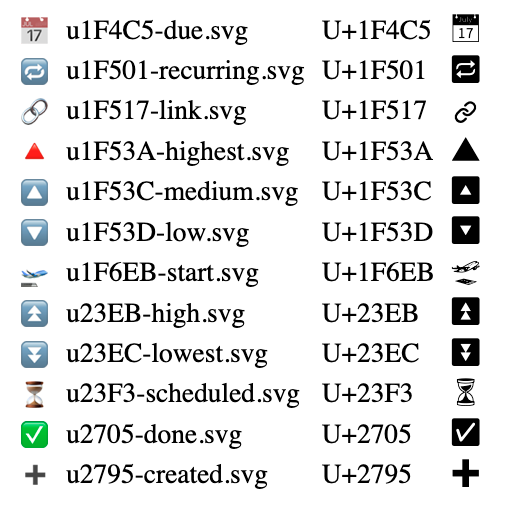
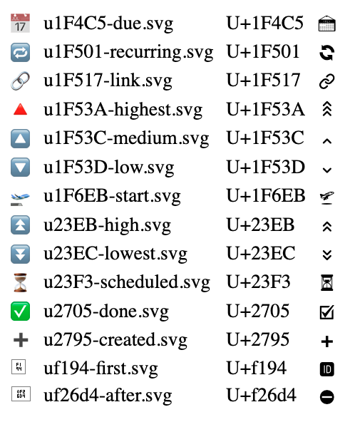

# Obsidian Tasks Custom Icons

This repository contains a commandline tool (for developers/designers) to easily create CSS snippets that when added to Obsidian will replace the emojis used by the [Obsidian Tasks](https://github.com/obsidian-tasks-group/obsidian-tasks) with monochrome icons matching the text colour.

As a Tasks end-user, you can simply [install](https://help.obsidian.md/Extending+Obsidian/CSS+snippets) one of the generated CSS snippets below to your obsidian vault to replace the [Tasks Emoji Format](https://publish.obsidian.md/tasks/Reference/Task+Formats/Tasks+Emoji+Format) emojis (in Live Preview or Reading modes) with monochrome icons.

## Lucide-based Icon set 2



[Download CSS Snippet](https://raw.githubusercontent.com/replete/obsidian-tasks-custom-icons/main/lucide2/obsidian-tasks-lucide2-icons.css)

Icons modified from https://lucide.dev

## NotoEmoji-based Icon set



[Download CSS Snippet](https://raw.githubusercontent.com/replete/obsidian-tasks-custom-icons/main/lucide2/obsidian-tasks-lucide2-icons.css)

Icons extracted from Google's [Noto Emoji](https://github.com/googlefonts/noto-emoji/blob/main/fonts/NotoColorEmoji.ttf) variable TTF font

## Lucide-based Icon set


[Download CSS Snippet](https://raw.githubusercontent.com/replete/obsidian-tasks-custom-icons/main/lucide/obsidian-tasks-lucide-icons.css)

Date and recurring icons modified from https://lucide.dev

## EmojiTwo-based Icon set



[Download CSS Snippet](https://raw.githubusercontent.com/replete/obsidian-tasks-custom-icons/main/emojitwo/obsidian-tasks-emojitwo-icons.css)

Date and recurring icons modified from https://github.com/EmojiTwo/emojitwo/tree/master/svg_bw


## Creating a custom icon set

**Prerequisites:** Node.JS must be installed. I cannot provide support if this is unfamiliar, but it is fairly straightforward:

- Clone/fork/download this repository
- From a terminal, run `npm install` from the cloned/forked/downloaded directory
- Duplicate the `TaskMonoEmojis-notoemoji` folder, renaming it to your new icon set name, e.g. `TaskMonoEmojis-fancyicons`. Folder naming format: `{font name}-{icon set name}`. The font name determines the CSS @font-face font name (e.g. `TasksMonoEmojis`) and the 'icon set name' (e.g.`fancyicons`) - merely a descriptive folder name.
- Replace/edit the duplicated SVG files in your new folder
- Run `npm run build`, to generate `{folder name}.css` (embedded woff2 font, license comment, and obsidian CSS snippet) `{folder name}.html` (quick demonstration of the font in action), and `{folder name}.woff2` (separate woff2 file, not needed for snippets) files within each folder. This tool will generate fonts for each of the 'icon set' folders in the directory each time it is run.
    - _Dev Tip:_ In your new 'icon set' folder, create a text file named `copysnippetpath.txt` containing an absolute path to another folder – e.g '`/Users/username/MyVault/.obsidian/snippets/`'. This will cause an extra copy of `{folder name}.css` to be written each time you run `npm run build`. If you specify your Obsidian snippet folder and enable it within obsidian, Obsidian will reload the snippet whenever it changes.
    - Each SVG must be named with the format `u{unicode hex number}-{name}`, as this is used to assign the glyphs during creation of the webfont. The name (after the hyphen) is only used for the generated HTML file. 
    - Because of how this works, this tool can be used to generate webfonts for other scenarios than an Obsidian plugin, you'd just need to adjust the `ImplementationCSS` variable string template in index.js according to your needs.
- Adjust SVG icons as desired
- Replace `LICENSE.TXT` as appropriate, if you take icons from somewhere rather than creating your own artwork, the license should be honored and reproduced here

## CSS Snippet details
This tool generates CSS snippets usable by Obsidian for the purpose of replacing the Task Emojis Format emojis for task lines in obsidian notes. It currently uses the following rule for styling, which only applies the monochrome fonts to task lines in the normal editor, and task dataview. This works for Live Preview and Reading mode, though the rule could easily be adapted to also apply to source mode view.

```css
/*! 
License info...
*/
@font-face {
    font-family: 'TasksMonoEmojis';
    src: url('data:@file/octet-stream;base64,d09GMgABAAAAAAdkAAsAAAAANOTREALDONTUSETHIS...') format('woff2');
    unicode-range: U+1F4C5, U+1F501, U+1F53C, U+1F53D, U+1F6EB, U+23EB, U+23F3, U+2705, U+2795;
    /* 📅, 🔁, 🔼, 🔽, 🛫, ⏫, ⏳, ✅, ➕ */
    /*! Generator: obsidian-tasks-custom-icons vX.X.X https://github.com/replete/obsidian-tasks-custom-icons */
}

span.tasks-list-text,
.cm-line:has(.task-list-label) [class^=cm-list-] {
    font-family: 'TasksMonoEmojis', var(--font-text);
}
```

Please open an issue in github if you discover any issues.

## Support development

<a href="https://www.buymeacoffee.com/replete"></a>